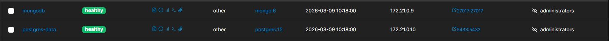
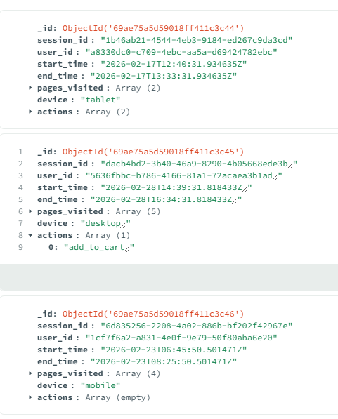
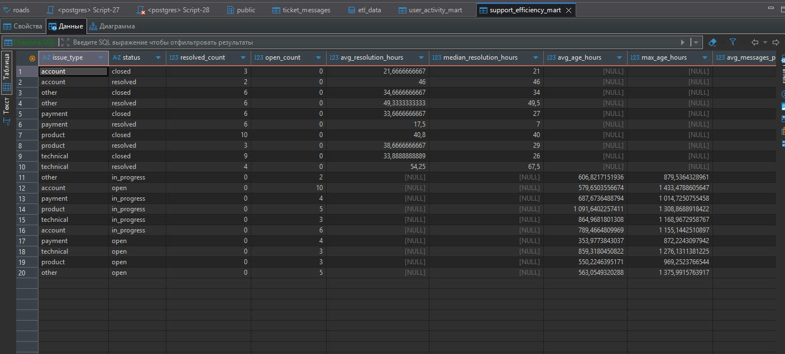
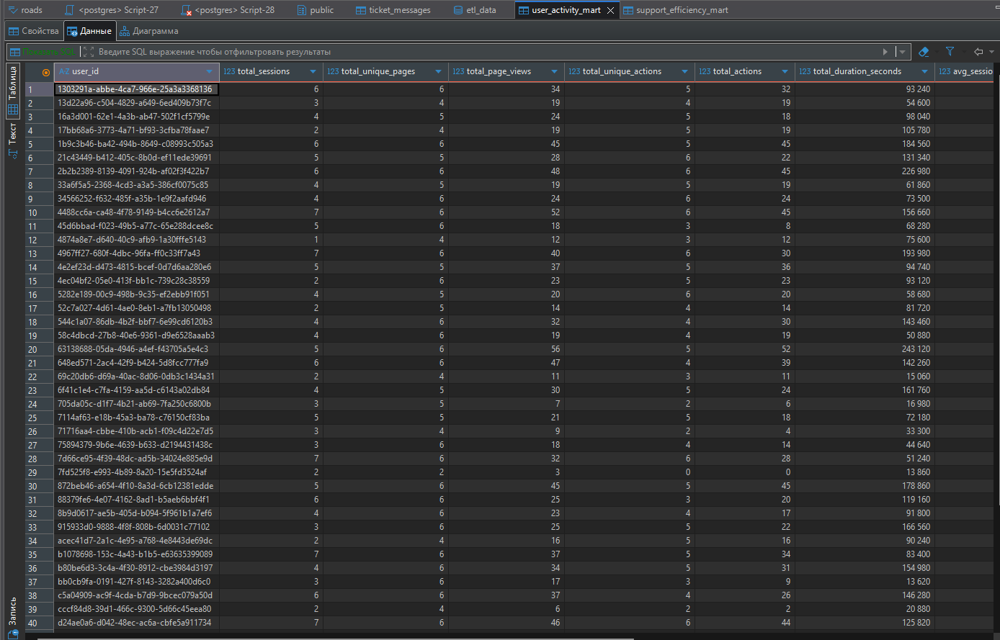
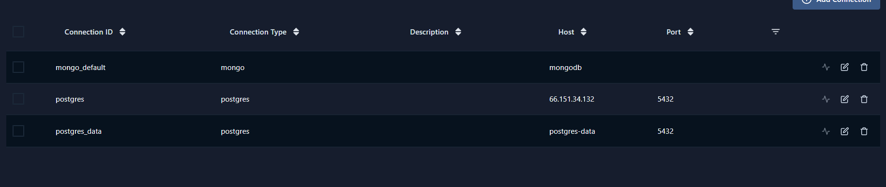

# Все файлы дагов находятся в server/dags
___
# Домашнее задание №1
## DAG - json_to_db и xml_to_db
## /дз_1

## Проблемы 

`from airflow.providers.postgres.operators.postgres import PostgresOperator` не хотел импортироваться, хотя я запустил последнюю версию и использовал новейшие пакеты
___

# Домашнее задание №2 ( Вебинар 3)

## DAG - dz_2
## /dz_2
___

# Домашнее задание №3 ( Вебинар 4)
## Коментарий:
### Тк данные за 2018 год -> я ручками попарив 2 даты, что бы было понятна работа кода 
#### Еще можно увидеть в предыдущем коммите код, где всё сделаоно в одном dag. Коммит: ed4730f0b6f2094bba5e36d263629eb6a8c4acb2
## DAG - dz_3_full и dz_3_incremental
## /dz_3
___

# Финальное ДЗ 

| Критерии                                                                                   | Адрес                                  | Скрин                                                                                                                                |
| ------------------------------------------------------------------------------------------ | -------------------------------------- | ------------------------------------------------------------------------------------------------------------------------------------ |
| Развёрнута реляционная база данных                                                         | server_other/docker-compose-other.yaml |                                                                                                        |
| Развёрнута нереляционная база данных                                                       | server_other/docker-compose-other.yaml |                                                                                                        |
| Сгенерированы данные для нереляционной базы данных                                         | server_other/scripts/generate_data     |                                                                                                    |
| Сформированы пайплайны для репликации в PostgreSQL + Airflow                               | server_airflow/dags/replication_dag.py |                                                                                                                                      |
| Пайплайны должны содержать этап трансформации данных                                       | server_airflow/dags/replication_dag.py |                                                                                                                                      |
| Хранящиеся данные чистые: не имеют дублей, корректно партиционированы, поддаются аналитике |                                        |                                                                                                                                      |
| Пайплайны для репликации в PostgreSQL + Airflow описаны в документации                     |                                        |                                                                                                                                      |
| Сформированы пайплайны для создания аналитических витрин в Airflow                         | server_airflow/dags/mart_dags.py       |                                                                                                                                      |
| Создано 2 аналитические витрины в Airflow                                                  |                                        | ![img][dz_final/mart_1.png]      |

## Запуск

1)airflow 
	Перейти в папку с айрфлов и поднять его -  `docker compose up -d`
2)BD
	Перейти в папку с БД и поднять его -  `docker compose -f "docker-compose-other.yml" up -d`
3)Заполнить MONGO данными 
	`docker run --rm -it --network airflow_default -v $(pwd):/scripts python:3.9 bash -c "pip install pymongo faker && python /scripts/generate_data.py"`
4)Добавить в айрфлов через админку источники данных
	
	